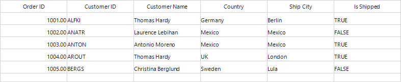

# How to convert the WinForms DataGrid (SfDataGrid) to Image?

## About the sample
This example illustrates how to convert the [WinForms DataGrid](https://www.syncfusion.com/winforms-ui-controls/datagrid) (SfDataGrid) to Image?

[WinForms DataGrid](https://www.syncfusion.com/winforms-ui-controls/datagrid) (SfDataGrid) can be exported into **Excel** and **PDF** files. It also possible to convert the exported excel file into Image without saving the excel file in system with the help of **IWorksheet.ConvertToImage** method.

```C#

using Syncfusion.WinForms.DataGridConverter;
using Syncfusion.XlsIO;

private void BtnExportExcel_Click(object sender, EventArgs e)
{
            var excelExportingOptions = new ExcelExportingOptions();
            var excelEngine = sfDataGrid.ExportToExcel(sfDataGrid.View, excelExportingOptions);
            IWorkbook workbook = excelEngine.Excel.Workbooks[0];
            IWorksheet sheet = workbook.Worksheets[0];
            sheet.UsedRangeIncludesFormatting = false;
            int lastRow = sheet.UsedRange.LastRow + 1;
            int lastColumn = sheet.UsedRange.LastColumn;
            System.Drawing.Image img = sheet.ConvertToImage(1, 1, lastRow, lastColumn, ImageType.Bitmap, null);
            img.Save("Sample.png", ImageFormat.Png);
            System.Diagnostics.Process.Start("Sample.png");
}

```
#### Note:
```    
   The following assemblies are required for converting the SfDataGrid to excel and image.
        1. Syncfusion.Compression.Base
        2. Syncfusion.SfDataGridConverter.WinForms
        3. Syncfusion.XlsIO.Base
```
The following screenshot shows the converted SfDataGrid to Image,


Take a moment to peruse the [WinForms DataGrid – Export to Excel](https://help.syncfusion.com/windowsforms/datagrid/exporttoexcel) documentation, where you can find about export to excel with code examples.

## Requirements to run the demo
Visual Studio 2015 and above versions
